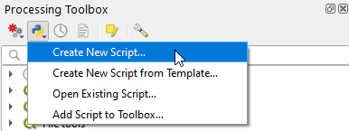

# QGIS Processing Scripts

QGIS users can add new Processing algorithms using Python, see https://docs.qgis.org/testing/en/docs/user_manual/processing/scripts.html .

## Adding new script

Once the script is created / downloaded, users have two options to add a new script to the toolbox:

1. Select `Create New Script...` from **Scripts** dropdown icon in the Processing Toolbox. 
   Copy / paste the script code into the editor and save it to Python scripts folder of your QGIS profile folder.
   In Windows it is located in 
   
   `C:\Users\<YourUsername>\AppData\Roaming\QGIS\QGIS3\profiles\default\python\scripts`
 
2. Select option `Add script to Toolbox...`, select a processing algorithm script and save it to your profile folder. 
   See option 1 for the location.